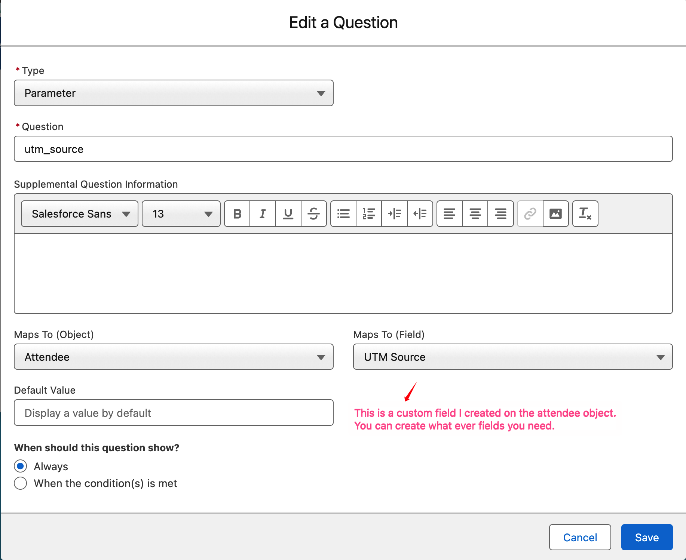
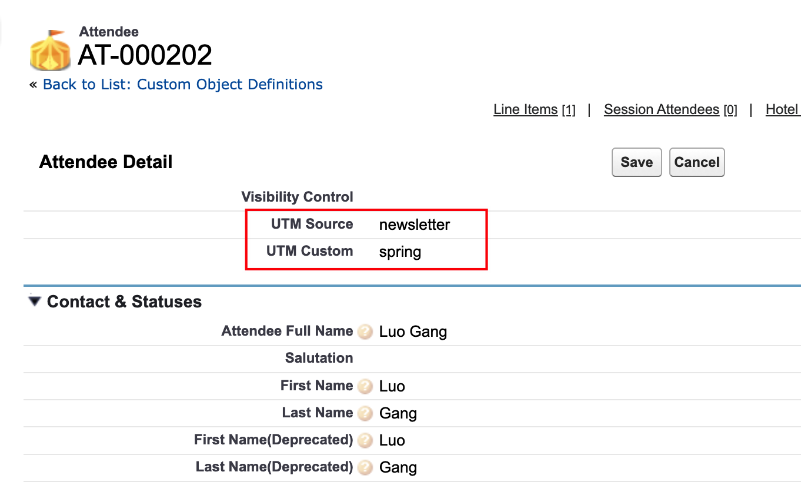

# Blackthorn iframe UTM demo

A static page that embeds a Blackthorn Events registration page via the
`events.blackthorn.io/loader` script, and forwards UTM parameters from the
parent page's URL into the embedded experience.

Live: https://crysislinux.github.io/blackthorn-iframe-utm-demo/?utm_source=newsletter&utm_custom=spring

## Configure the embedded page

Open `index.html` and edit one line:

```js
const DATA_PATH = "/en/4PyFnx6/g/C0P27sDc5B";
```

Commit and push — GitHub Pages redeploys in ~1 minute.

## How forwarding works

Instead of writing the loader `<script>` tag statically in HTML, the page
constructs it in JS so it can append UTMs to the `data-path` before the loader
runs. So a parent URL like

```
?utm_source=newsletter&utm_custom=spring
```

results in the loader receiving

```
data-path="/en/4PyFnx6/g/C0P27sDc5B?utm_source=newsletter&utm_custom=spring"
```

## Forwarded parameters

By default: `utm_source`, `utm_custom`.

Blackthorn supports any parameter prefixed with `utm_` — add the names you need
to the `FORWARDED_PARAMS` array in `index.html`.

## Capturing the values in Salesforce

To persist the forwarded UTMs on the attendee record:

1. Create a form (or use an existing one) and attach it to the event.
2. Add a form element of type **Parameter** for each UTM you want to capture.
3. Set the element's **Question Text** to the exact UTM parameter name
   (e.g. `utm_source`, `utm_custom`).
4. Map the element to a field on the **Attendee** object. The target field must
   be text-compatible (Text, Long Text Area, etc.) since the parameter value
   arrives as a string.

   

5. Open the event using the preview URL — or click **Update** on the event — so
   the form changes take effect on the embedded registration page.

After someone registers through the embedded form, the Attendee record shows
the captured UTM values:



## Try it locally

```sh
python3 -m http.server 8000
# then open http://localhost:8000/?utm_source=test&utm_custom=demo
```

Open DevTools, find the iframe injected inside `#embed`, and confirm its `src`
contains the appended UTMs.
